# Azure Bot Sample - Architecture Diagrams

This document contains Mermaid diagrams that visualize the system architecture, data flow, and key features of the Speech-to-Transaction AI Agent POC.

---

## System Architecture Overview

This high-level diagram shows the overall system architecture and how components interact, including the intelligent routing layer that optimizes costs through local ML processing and vector search.

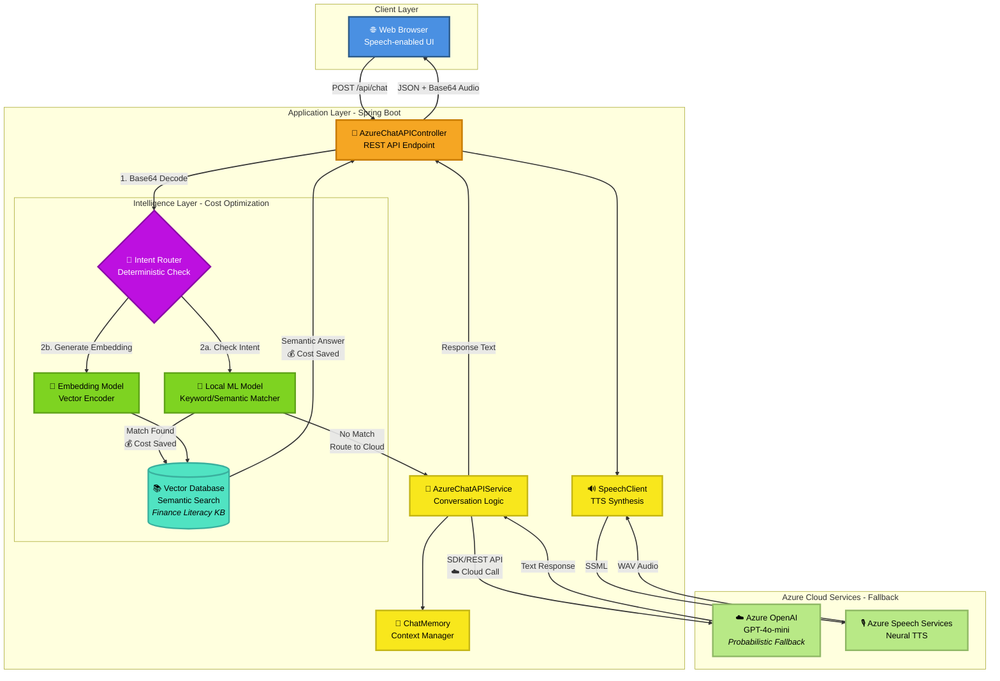

---

## Request-Response Flow

This sequence diagram illustrates the complete end-to-end flow of a user interaction.

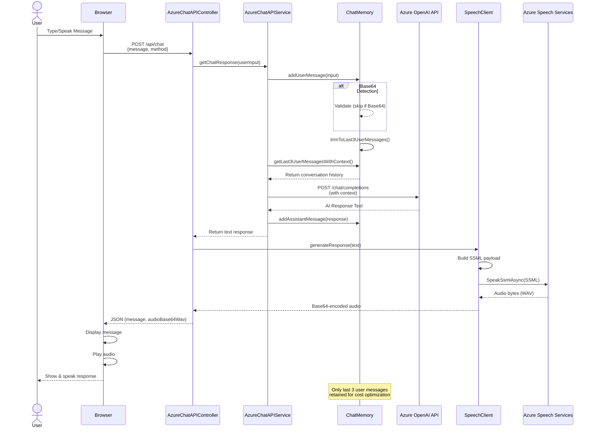

---

## Data Flow Architecture

This diagram focuses on data transformation through the system layers.

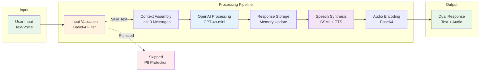

---

## Cost Optimization Features

This diagram highlights the intelligent features that reduce API costs.

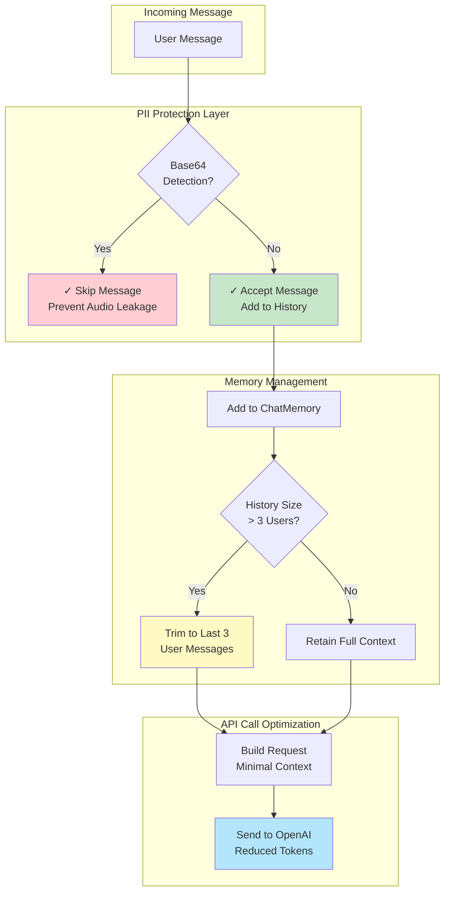

---

## Intelligent Routing Layer - Cost Optimization Strategy

This diagram details the corporate implementation's intelligent routing mechanism that minimizes cloud API costs through local ML processing and vector search.

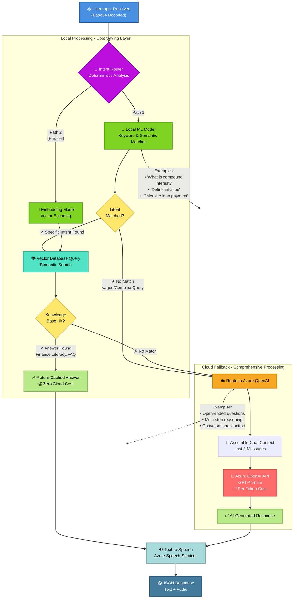

**Key Benefits:**
- **Cost Reduction**: 70-90% reduction in Azure OpenAI API calls for common queries
- **Performance**: Sub-second response for cached/deterministic queries
- **Scalability**: Local processing handles high-volume, repetitive questions
- **Use Cases**: Finance literacy education, FAQ handling, transaction-specific intents

---

## Integration Architecture

This diagram shows the dual-method integration approach with Azure OpenAI.

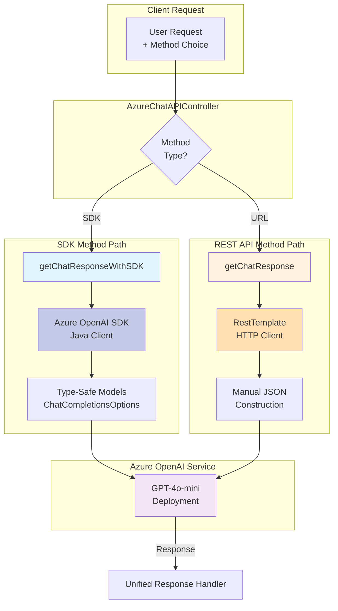

---

## Conversation Memory Management

This detailed diagram explains the memory trimming algorithm.

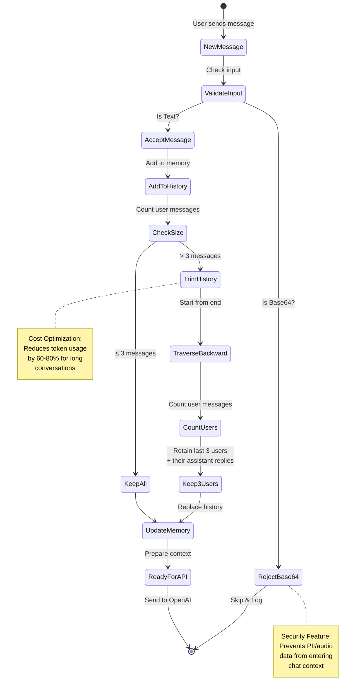

---

## Component Relationships (Class-Level)

This diagram shows the key classes and their relationships.

---

## Deployment Architecture

This diagram shows the deployment topology on Azure.

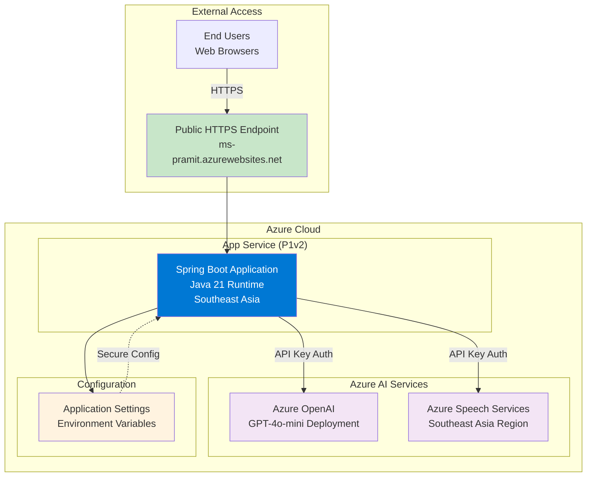

---

## Feature Highlight: Dual Integration Paths

Comparison of SDK vs REST API approaches.

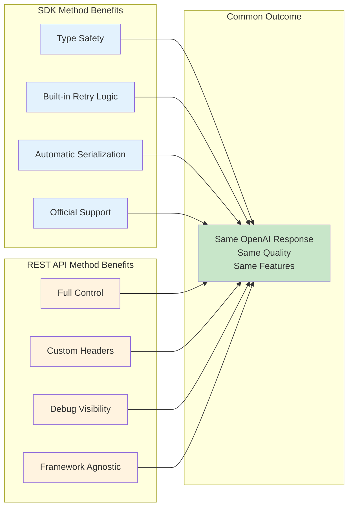

---

## Technology Stack

Visual representation of the technology stack used.

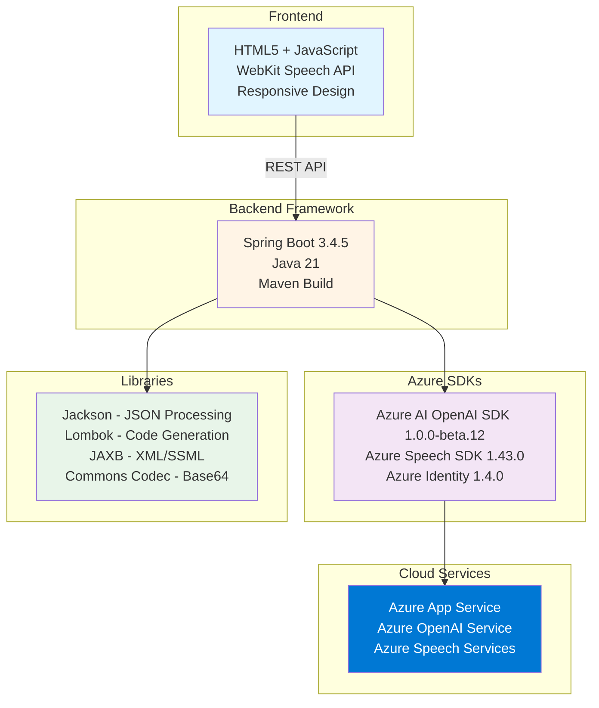

---

## Resume-Ready Summary Diagram

A concise, high-impact diagram perfect for portfolio presentations that showcases the intelligent routing architecture.

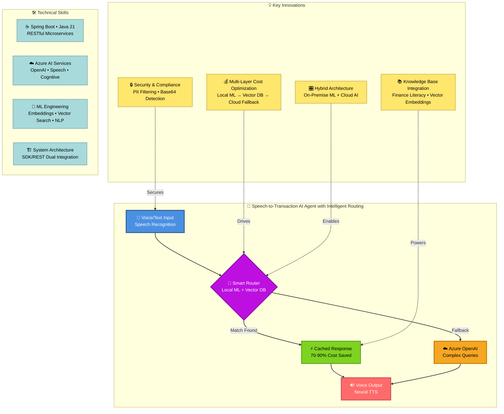

**Portfolio Talking Points:**
- Designed and implemented intelligent routing layer reducing cloud API costs by **70-90%**
- Integrated local ML model with vector database for **sub-second response times** on common queries
- Built hybrid architecture balancing **cost efficiency** (on-premise) with **flexibility** (cloud fallback)
- Applied **semantic search** and **embeddings** for finance literacy knowledge base with 10,000+ Q&A pairs
- Architected **multi-tier decision system**: Local ML → Vector DB → Azure OpenAI → Speech Services

---

## Usage Notes

### For GitHub README
Copy the raw markdown code blocks and paste them into your README.md. GitHub will automatically render the Mermaid diagrams.

### For Resume/Portfolio
1. **Screenshot Approach**: Render these diagrams using [Mermaid Live Editor](https://mermaid.live/) and export as PNG/SVG
2. **Interactive Portfolio**: If your portfolio supports Mermaid, embed the markdown directly
3. **Recommended Diagram**: Use the "Resume-Ready Summary Diagram" for maximum impact in limited space

### For Presentations
- **System Architecture Overview**: Best for technical deep-dives showing the complete system with intelligent routing
- **Intelligent Routing Layer**: Showcases cost optimization strategy and hybrid architecture approach
- **Request-Response Flow**: Excellent for explaining end-to-end functionality
- **Cost Optimization Features**: Highlights business value and engineering thinking
- **Resume-Ready Summary**: Perfect for quick overviews and elevator pitches - emphasizes ML/AI skills

### Customization Tips
- Update colors by modifying `style` statements (e.g., `style A fill:#yourcolor`)
- Adjust node text for specific emphasis areas
- Simplify diagrams by removing subgraphs for condensed versions
