# Azure Bot Sample - Architecture Diagrams

This document contains Mermaid diagrams that visualize the system architecture, data flow, and key features of the Speech-to-Transaction AI Agent POC.

---

## System Architecture Overview

This high-level diagram shows the overall system architecture with dual-path routing: deterministic (local ML) and probabilistic (vector DB + cloud fallback), with PII masking at the security boundary.

```mermaid
graph TB
    subgraph "Client Layer"
        UI["🌐 Web Browser<br/>Speech-enabled UI"]
    end

    subgraph "Application Layer - Spring Boot"
        Controller["📡 AzureChatAPIController<br/>REST API Endpoint"]

        subgraph "Security Layer"
            PIIMask["🔒 PII Masking<br/>ML-Regex Hybrid<br/><i>Bank Data Protection</i>"]
        end

        subgraph "Intelligence Layer - Dual Path Routing"
            Router{"🎯 Intent Router"}

            subgraph "Path 1: Deterministic - Local"
                LocalML["🤖 Local ML Model<br/>Keyword/Semantic Matcher"]
            end

            subgraph "Path 2: Probabilistic - Cloud"
                Embedding["🔢 Embedding Model<br/>Vector Encoder"]
                VectorDB[("📚 Vector Database<br/>Semantic Search<br/><i>Finance Literacy KB</i>")]
                ChatService["💬 AzureChatAPIService<br/>Conversation Logic"]
                Memory["💾 ChatMemory<br/>Context Manager"]
            end
        end

        SpeechService["🔊 SpeechClient<br/>TTS Synthesis"]
    end

    subgraph "Azure Cloud Services"
        OpenAI["☁️ Azure OpenAI<br/>GPT-4o-mini"]
        Speech["🎙️ Azure Speech Services<br/>Neural TTS"]
    end

    UI -->|"POST /api/chat"| Controller
    Controller -->|"1. Decode Input"| PIIMask
    PIIMask -->|"2. Masked Input"| Router

    Router -->|"Deterministic<br/>Specific Intent"| LocalML
    Router -->|"Probabilistic<br/>Complex Query"| Embedding

    LocalML -->|"✓ Match Found<br/>💰 Local Response"| SpeechService

    Embedding --> VectorDB
    VectorDB -->|"KB Hit"| SpeechService
    VectorDB -->|"No Match<br/>Fallback"| ChatService

    ChatService --> Memory
    ChatService -->|"SDK/REST API<br/>☁️ Cloud Call"| OpenAI
    OpenAI -->|"Text Response"| ChatService
    ChatService -->|"AI Response"| SpeechService

    SpeechService -->|"SSML"| Speech
    Speech -->|"WAV Audio"| SpeechService
    SpeechService -->|"Text + Audio"| Controller
    Controller -->|"JSON + Base64 Audio"| UI

    %% Styling for visibility in both light and dark modes
    style UI fill:#4A90E2,stroke:#2E5C8A,stroke-width:3px,color:#FFFFFF
    style Controller fill:#F5A623,stroke:#C77B00,stroke-width:3px,color:#000000
    style PIIMask fill:#FF6B6B,stroke:#CC5555,stroke-width:3px,color:#FFFFFF
    style Router fill:#BD10E0,stroke:#8B0AA8,stroke-width:3px,color:#FFFFFF
    style LocalML fill:#7ED321,stroke:#5FA319,stroke-width:3px,color:#000000
    style Embedding fill:#A8DADC,stroke:#7EADB0,stroke-width:3px,color:#000000
    style VectorDB fill:#50E3C2,stroke:#3AB09E,stroke-width:3px,color:#000000
    style ChatService fill:#F8E71C,stroke:#C4B616,stroke-width:3px,color:#000000
    style SpeechService fill:#F8E71C,stroke:#C4B616,stroke-width:3px,color:#000000
    style Memory fill:#FFE66D,stroke:#CCB857,stroke-width:3px,color:#000000
    style OpenAI fill:#B8E986,stroke:#8FB865,stroke-width:3px,color:#000000
    style Speech fill:#B8E986,stroke:#8FB865,stroke-width:3px,color:#000000

    %% Link styling for better visibility
    linkStyle default stroke:#333,stroke-width:2px
```

---

## Request-Response Flow

This sequence diagram illustrates the complete end-to-end flow of a user interaction.

---

## Data Flow Architecture

This diagram focuses on data transformation through the dual-path system with PII masking at the security boundary.

```mermaid
flowchart TD
    subgraph Input
        A["User Input<br/>Text/Voice"]
    end

    subgraph "Security Boundary"
        B["Base64 Decode"]
        C["PII Masking<br/>ML-Regex Hybrid<br/>🏦 Bank Data Protection"]
    end

    subgraph "Routing Layer"
        D{"Intent Router<br/>Deterministic vs<br/>Probabilistic"}
    end

    subgraph "Path 1: Local ML Processing"
        E["Local ML Model<br/>Intent Matching"]
        F["Predefined Response<br/>💰 Zero Cost"]
    end

    subgraph "Path 2: Probabilistic Processing"
        G["Embedding Model<br/>Vector Encoding"]
        H["Vector DB Search<br/>Finance KB"]
        I{"KB Hit?"}
        J["Context Assembly<br/>Last 3 Messages"]
        K["Azure OpenAI<br/>GPT-4o-mini<br/>💸 Per-Token Cost"]
    end

    subgraph "Output Generation"
        L["Text-to-Speech<br/>Azure TTS<br/>SSML + WAV"]
        M["Response Package<br/>Text + Base64 Audio"]
    end

    A --> B
    B --> C
    C --> D

    D -->|"Specific Intent"| E
    E --> F
    F --> L

    D -->|"Complex Query"| G
    G --> H
    H --> I
    I -->|"✓ Match"| L
    I -->|"✗ Fallback"| J
    J --> K
    K --> L

    L --> M

    %% High-visibility styling
    style A fill:#4A90E2,stroke:#2E5C8A,stroke-width:3px,color:#FFFFFF
    style B fill:#A8DADC,stroke:#7EADB0,stroke-width:2px,color:#000000
    style C fill:#FF6B6B,stroke:#CC5555,stroke-width:4px,color:#FFFFFF
    style D fill:#BD10E0,stroke:#8B0AA8,stroke-width:3px,color:#FFFFFF
    style E fill:#7ED321,stroke:#5FA319,stroke-width:3px,color:#000000
    style F fill:#B8E986,stroke:#8FB865,stroke-width:2px,color:#000000
    style G fill:#A8DADC,stroke:#7EADB0,stroke-width:3px,color:#000000
    style H fill:#50E3C2,stroke:#3AB09E,stroke-width:3px,color:#000000
    style I fill:#FFE66D,stroke:#CCB857,stroke-width:2px,color:#000000
    style J fill:#FFE66D,stroke:#CCB857,stroke-width:3px,color:#000000
    style K fill:#F5A623,stroke:#C77B00,stroke-width:3px,color:#000000
    style L fill:#A8DADC,stroke:#7EADB0,stroke-width:3px,color:#000000
    style M fill:#457B9D,stroke:#345A72,stroke-width:3px,color:#FFFFFF

    linkStyle default stroke:#333,stroke-width:2px
```

---

## Cost Optimization Features

This diagram highlights the intelligent features that reduce API costs.

---

## Intelligent Routing Layer - Cost Optimization Strategy

This diagram details the dual-path routing mechanism with PII masking at the security boundary: Path 1 (Deterministic/Local) and Path 2 (Probabilistic/Cloud with Vector DB + OpenAI fallback).

```mermaid
flowchart TD
    Start["📥 User Input Received<br/>(Base64 Decoded)"] --> PIIMask["🔒 PII Masking Layer<br/>ML-Regex Hybrid Model"]

    PIIMask -->|"Masked Input<br/>🏦 Bank Data Protected"| Router{"🎯 Intent Router<br/>Route Decision"}

    subgraph "Path 1: Deterministic - Local ML (Fast & Free)"
        Router -->|"Specific Intent<br/>Recognized"| LocalML["🤖 Local ML Model<br/>Keyword & Semantic Matcher"]
        LocalML --> IntentCheck{"Intent<br/>Matched?"}
        IntentCheck -->|"✓ Match Found"| LocalResponse["✅ Return Predefined Answer<br/>💰 Zero Cloud Cost<br/>⚡ <100ms Response"]
    end

    subgraph "Path 2: Probabilistic - Cloud Processing (Comprehensive)"
        Router -->|"Complex/Vague<br/>Query"| Embedding["🔢 Embedding Model<br/>Vector Encoding"]

        Embedding --> VectorDB[("📚 Vector Database<br/>Semantic Search<br/><i>Finance Literacy KB</i>")]

        VectorDB --> KBCheck{"Knowledge<br/>Base Hit?"}

        KBCheck -->|"✓ Answer Found"| VectorResponse["✅ Return KB Answer<br/>💰 Low Cost<br/>⚡ <500ms Response"]

        KBCheck -->|"✗ No Match<br/>OpenAI Fallback"| ContextAssembly["💾 ChatMemory<br/>Assemble Last 3 Messages"]

        ContextAssembly --> OpenAI["🤖 Azure OpenAI API<br/>GPT-4o-mini<br/>💸 Per-Token Cost"]
        OpenAI --> CloudResponse["✅ AI-Generated Response<br/>💸 Full Cost<br/>~2s Response"]
    end

    IntentCheck -->|"✗ No Match<br/>Route to Path 2"| Embedding

    LocalResponse --> TTS["🔊 Text-to-Speech<br/>Azure Speech Services"]
    VectorResponse --> TTS
    CloudResponse --> TTS
    TTS --> Output["📤 JSON Response<br/>Text + Base64 Audio"]

    %% Annotations with examples
    LocalML -.->|"Examples:<br/>• 'Define compound interest'<br/>• 'What is APR?'<br/>• 'Calculate 5% of 1000'"| Note1[ ]
    VectorDB -.->|"Examples:<br/>• 'How to save for retirement?'<br/>• 'Explain mortgage types'<br/>• Finance quiz questions"| Note2[ ]
    OpenAI -.->|"Examples:<br/>• Open-ended discussions<br/>• Multi-step reasoning<br/>• Conversational follow-ups"| Note3[ ]

    %% High-visibility styling
    style Start fill:#4A90E2,stroke:#2E5C8A,stroke-width:3px,color:#FFFFFF
    style PIIMask fill:#FF6B6B,stroke:#CC5555,stroke-width:4px,color:#FFFFFF
    style Router fill:#BD10E0,stroke:#8B0AA8,stroke-width:3px,color:#FFFFFF
    style LocalML fill:#7ED321,stroke:#5FA319,stroke-width:3px,color:#000000
    style LocalResponse fill:#B8E986,stroke:#8FB865,stroke-width:3px,color:#000000
    style Embedding fill:#A8DADC,stroke:#7EADB0,stroke-width:3px,color:#000000
    style VectorDB fill:#50E3C2,stroke:#3AB09E,stroke-width:3px,color:#000000
    style VectorResponse fill:#B8E986,stroke:#8FB865,stroke-width:3px,color:#000000
    style ContextAssembly fill:#FFE66D,stroke:#CCB857,stroke-width:3px,color:#000000
    style OpenAI fill:#FF6B6B,stroke:#CC5555,stroke-width:3px,color:#FFFFFF
    style CloudResponse fill:#F5A623,stroke:#C77B00,stroke-width:3px,color:#000000
    style TTS fill:#A8DADC,stroke:#7EADB0,stroke-width:3px,color:#000000
    style Output fill:#457B9D,stroke:#345A72,stroke-width:3px,color:#FFFFFF
    style IntentCheck fill:#FFE66D,stroke:#CCB857,stroke-width:2px,color:#000000
    style KBCheck fill:#FFE66D,stroke:#CCB857,stroke-width:2px,color:#000000
    style Note1 fill:none,stroke:none
    style Note2 fill:none,stroke:none
    style Note3 fill:none,stroke:none

    linkStyle default stroke:#333,stroke-width:2px
```

**Key Benefits:**
- **Security First**: PII masking protects confidential bank data before any processing
- **Cost Reduction**: 70-90% reduction in Azure OpenAI API calls through dual-path routing
- **Performance Tiers**:
  - Path 1 (Local ML): <100ms response, zero cloud cost
  - Path 2a (Vector DB): <500ms response, minimal cost
  - Path 2b (OpenAI): ~2s response, full per-token cost
- **Scalability**: Local and vector processing handles high-volume, repetitive questions
- **Use Cases**:
  - Path 1: Transaction intents, simple definitions, calculations
  - Path 2a: Finance literacy education, FAQ retrieval, quiz answers
  - Path 2b: Complex reasoning, conversational AI, open-ended queries

---

## Integration Architecture

This diagram shows the dual-method integration approach with Azure OpenAI.

---

## Conversation Memory Management

This detailed diagram explains the memory trimming algorithm.

---

## Component Relationships (Class-Level)

This diagram shows the key classes and their relationships.

---

## Deployment Architecture

This diagram shows the deployment topology on Azure.

---

## Feature Highlight: Dual Integration Paths

Comparison of SDK vs REST API approaches.

---

## Technology Stack

Visual representation of the technology stack used.

---

## Resume-Ready Summary Diagram

A concise, high-impact diagram perfect for portfolio presentations showcasing the dual-path intelligent routing architecture with PII protection.

```mermaid
graph TB
    subgraph "🎯 Speech-to-Transaction AI Agent - Dual Path Architecture"
        Input["🎤 Voice/Text Input<br/>Speech Recognition"]
        PII["🔒 PII Masking<br/>ML-Regex Hybrid"]
        Router{"🧠 Smart Router<br/>Dual Path Decision"}

        subgraph "Path 1: Local"
            Local["⚡ Local ML<br/>Deterministic<br/>💰 Zero Cost"]
        end

        subgraph "Path 2: Cloud"
            Vector["📚 Vector DB<br/>Semantic Search"]
            OpenAI["☁️ Azure OpenAI<br/>AI Fallback"]
        end

        Output["🔊 Voice Output<br/>Neural TTS"]
    end

    subgraph "💡 Key Innovations"
        I1["🏦 Security-First Design<br/>PII Masking • Bank Data Protection"]
        I2["💰 Multi-Tier Cost Optimization<br/>Local ML → Vector DB → OpenAI"]
        I3["📚 Hybrid Knowledge Architecture<br/>Embeddings • 10K+ Finance Q&A"]
        I4["⚡ Performance Tiers<br/><100ms (Local) • <500ms (Vector) • ~2s (AI)"]
    end

    subgraph "🛠️ Technical Skills Demonstrated"
        T1["☕ Backend Engineering<br/>Spring Boot • Java 21 • REST APIs"]
        T2["☁️ Cloud Architecture<br/>Azure OpenAI • Speech • Cognitive Services"]
        T3["🤖 ML/AI Engineering<br/>Local Models • Vector DB • Embeddings • NLP"]
        T4["🏗️ System Design<br/>Dual-Path Routing • Hybrid On-Prem/Cloud"]
    end

    Input --> PII
    PII --> Router
    Router -->|"Specific Intent"| Local
    Router -->|"Complex Query"| Vector
    Vector -->|"No Match"| OpenAI
    Local --> Output
    Vector --> Output
    OpenAI --> Output

    I1 -.->|"Secures"| PII
    I2 -.->|"Drives"| Router
    I3 -.->|"Powers"| Vector
    I4 -.->|"Optimizes"| Router

    %% High-contrast styling for both light and dark modes
    style Input fill:#4A90E2,stroke:#2E5C8A,stroke-width:3px,color:#FFFFFF
    style PII fill:#FF6B6B,stroke:#CC5555,stroke-width:4px,color:#FFFFFF
    style Router fill:#BD10E0,stroke:#8B0AA8,stroke-width:3px,color:#FFFFFF
    style Local fill:#7ED321,stroke:#5FA319,stroke-width:3px,color:#000000
    style Vector fill:#50E3C2,stroke:#3AB09E,stroke-width:3px,color:#000000
    style OpenAI fill:#F5A623,stroke:#C77B00,stroke-width:3px,color:#000000
    style Output fill:#A8DADC,stroke:#7EADB0,stroke-width:3px,color:#000000

    style I1 fill:#FFE66D,stroke:#CCB857,stroke-width:2px,color:#000000
    style I2 fill:#FFE66D,stroke:#CCB857,stroke-width:2px,color:#000000
    style I3 fill:#FFE66D,stroke:#CCB857,stroke-width:2px,color:#000000
    style I4 fill:#FFE66D,stroke:#CCB857,stroke-width:2px,color:#000000

    style T1 fill:#B8E986,stroke:#8FB865,stroke-width:2px,color:#000000
    style T2 fill:#B8E986,stroke:#8FB865,stroke-width:2px,color:#000000
    style T3 fill:#B8E986,stroke:#8FB865,stroke-width:2px,color:#000000
    style T4 fill:#B8E986,stroke:#8FB865,stroke-width:2px,color:#000000

    linkStyle default stroke:#333,stroke-width:2px
```

**Portfolio Talking Points:**
- Architected **dual-path intelligent routing** system reducing cloud API costs by **70-90%**
- Implemented **PII masking layer** using ML-Regex hybrid model protecting confidential bank data
- Designed **3-tier performance architecture**: Local ML (<100ms) → Vector DB (<500ms) → Azure OpenAI (~2s)
- Integrated **vector embeddings** and semantic search for 10,000+ finance literacy Q&A knowledge base
- Built **hybrid on-premise/cloud system** balancing cost efficiency with AI flexibility
- **Tech Stack**: Spring Boot, Azure AI (OpenAI, Speech), Local ML Models, Vector Databases, RESTful APIs

---

## Usage Notes

### For GitHub README
Copy the raw markdown code blocks and paste them into your README.md. GitHub will automatically render the Mermaid diagrams.

### For Resume/Portfolio
1. **Screenshot Approach**: Render these diagrams using [Mermaid Live Editor](https://mermaid.live/) and export as PNG/SVG
2. **Interactive Portfolio**: If your portfolio supports Mermaid, embed the markdown directly
3. **Recommended Diagram**: Use the "Resume-Ready Summary Diagram" for maximum impact in limited space

### For Presentations
- **System Architecture Overview**: Best for technical deep-dives showing the complete system with intelligent routing
- **Intelligent Routing Layer**: Showcases cost optimization strategy and hybrid architecture approach
- **Request-Response Flow**: Excellent for explaining end-to-end functionality
- **Cost Optimization Features**: Highlights business value and engineering thinking
- **Resume-Ready Summary**: Perfect for quick overviews and elevator pitches - emphasizes ML/AI skills

### Customization Tips
- Update colors by modifying `style` statements (e.g., `style A fill:#yourcolor`)
- Adjust node text for specific emphasis areas
- Simplify diagrams by removing subgraphs for condensed versions
